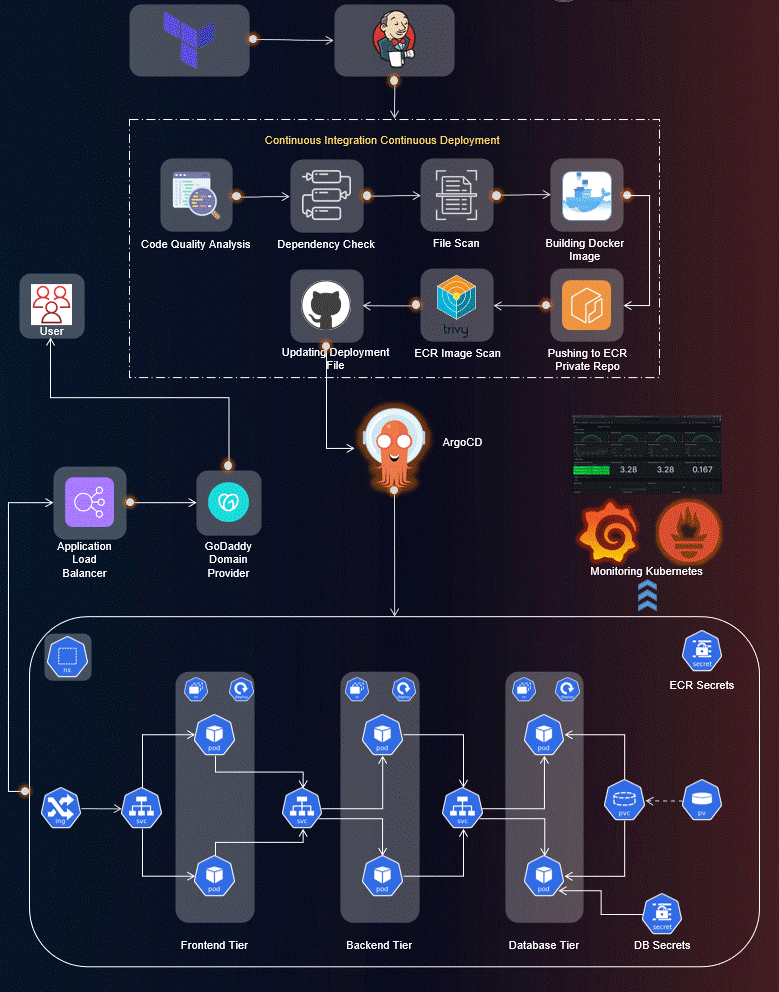

# 3-tier-Production-Grade-Devops-Project-with-terraform
Production-grade 3-tier MERN application deployed on AWS EKS with Terraform, Kubernetes, and CI/CD automation.
Here is the DevOps WorkFlow process of this project.



## STEPS:
### 1. create an IAM user and generate the AWS Access key
### 2. Install Terraform & AWS CLI 
    #### Terraform Installation Script
    #### AWS CLI Installation Script
    #### Configure terraform & AWS CLI
### 3. Deploy Jenkins Server (EC2) using Terraform
    #### Go to the Jenkins-Server-TF file
    #### Run the Terraform for provisioning
    #### Connect the Jenkins Server through SSH
### 4. Configure the Jenkins
    #### Check Validation all packages are properly install
    #### Install Suggested Plugins for Jenkins & configure jenkins for ready
    #### Install AWS Credentials plugins & put the Aws credentials as kind
### 5. Deploy the EKS Cluster
    #### Creating eks cluster through command line
### 6. Now, Configure the Load Balancer or EKS Beacause our application will have an ingress controller
    #### Download the policy for the LoadBalancer prerequisite.
    #### Create the IAM policy using command line.
    ```CLI
    aws iam create-policy --policy-name AWSLoadBalancerControllerIAMPolicy --policy-document file://iam_policy.json
    ```
    #### Create OIDC provider & Service account for eksctl
    #### Deploy AWS Load Balancer Controller
    ```terminal
    sudo snap install helm --classic
    helm repo add eks https://aws.github.io/eks-charts
    helm repo update eks
    helm install aws-load-balancer-controller eks/aws-load-balancer-controller -n kube-system --set clusterName=my-cluster --set serviceAccount.create=false --set serviceAccount.name=aws-load-balancer-controller
    ```
    #### Check whether pods are running or not
### 7. Create Amazon ECR Private repositories for both Tiers (Frontend & Backend)
    #### Configure the ECR locally & Copy the first command to run on jenkins server.
### 8. Install & configure ArgoCD
    #### Create a namespace
    #### Create a secret ECR repo command to pull the docker image & add those secrets to the deployment file.
    #### Create a separate namespace for argoCD & apply argocd installation through kubectl command.
    #### Expose the argoCD server as a LoadBalancer.
    #### Retrive argoCD password through installing Prerequisite **jq**
### 9. Configure the SonarQube for DevSecOps Pipeline
    #### Setup the sonarQube after installation & create a webhooks after administration configuration
    #### create a project for locally 
    #### After the project setup uou can see a excution code for server
    #### Do all those above steps for sonarQube frontend & backend too.
### 10. Install require plugins on jenkins for 3-tier application deployment
    #### Setup all those required plugins - list
    *Docker
    Docker Commons
    Docker Pipeline
    Docker API
    docker-build-step
    Eclipse Temurin installer
    NodeJS
    OWASP Dependency-Check
    SonarQube Scanner*
    #### Setup jdk 
    #### Setup sonarQube 
    #### Setup nodejs with proper version name
    #### setup dependency-check & also docker
    #### Now Setup for SonarQube with jenkins server ip.
    #### Setup jenkins pipeline with jenkins code which are place in Jenkins-Pipeline-Code Folder for both backend & frontend.
### 11. MOnitoring Setup for EKS Cluster
    #### Add prometheus repo to hlem & install Prometheus, Grafana
    #### Need to outside grafana & prometheus console, setup service type LoadBalancer
## 12. Deploy Three-tier application using Argo-CD
    #### Coonect Repo using https
    #### Create Application for database,frontend, Backend & ingress from this repo directory kubernetes-Manifests-file
    #### Create application load balancer for four k8s

# Congratulation , Project is setup 

Let's Check all the tools are correctly placed & work.

    

